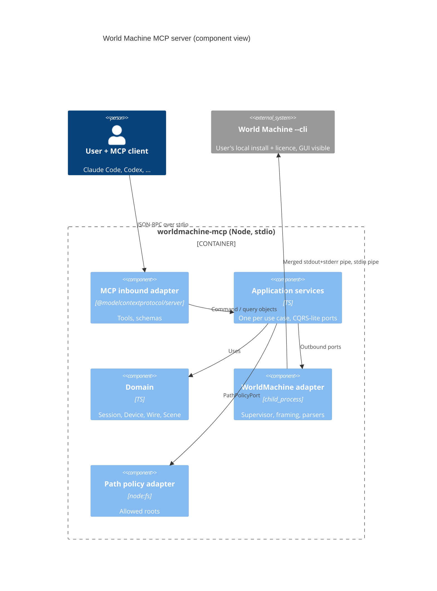
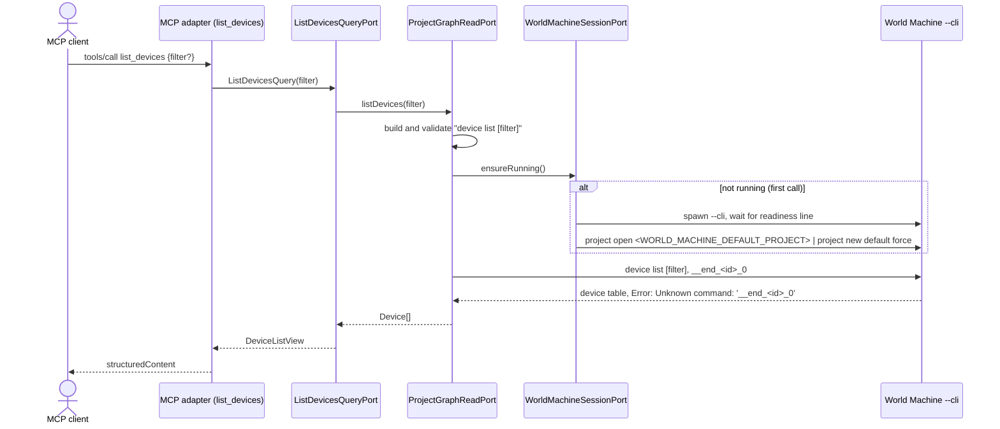
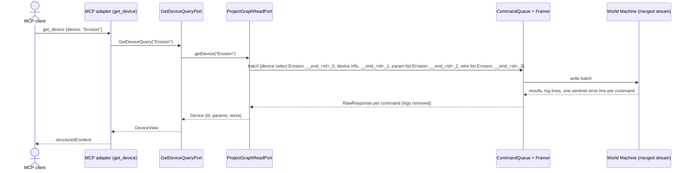

# worldmachine-mcp design

Date: 2026-10-04
Status: draft, awaiting review
Background: [feasibility findings](../../research/2026-10-04-feasibility-findings.md)

## 1. Purpose and scope

`worldmachine-mcp` is a public, MIT-licensed MCP server that lets any MCP client (Claude Code, Codex, Claude Desktop, Cursor, and others) inspect and edit World Machine projects through the user's own local World Machine installation and licence.

- Distribution: local stdio server, installed with a one-line client configuration (`npx -y @hoakt/worldmachine-mcp`).
- Platforms: Linux is the first slice. Windows and macOS are planned; the design keeps OS-specific code inside one adapter so they can be added without touching the domain or tool layers.
- World Machine is the only component that reads or writes `.tmd` files. The server never parses or edits project files directly.
- Nothing from World Machine is bundled. Users supply their own installation and licence.

### Releases

| Release | Content |
|---|---|
| v1 (this spec) | process adapter, read tools, project lifecycle, controlled graph edits, save, undo and redo |
| v2 | preview and full builds, exports, snapshots, organize |
| v3 | declarative `apply_graph` with dry-run plan and graph diff |

v2 and v3 get their own specs. This document specifies v1 only.

## 2. Verified facts this design rests on

Verified on 2026-10-04 against World Machine build 4067 (Dragontail Peak), Pro tier, Linux AppImage.

1. `--cli` works over plain pipes. No PTY is required. Commands are read from stdin and executed.
2. Over pipes, no `wm>` prompt is printed.
3. Command results are written to stdout, typically as a block ending in a blank line.
4. Command errors are written to stderr as a single line: `Error: Unknown command: '<cmd>'. Type 'help' for a list of commands.`
5. Application log lines are written to stdout with a `[Level      ] ` prefix and can appear between command results.
6. Startup readiness is signalled by the log line `Startup: Completed. Transferring control into event loop.` (about 4 s after spawn in testing).
7. `--cli` boots the full GUI. A window is shown. This is accepted behaviour (it gives the user a live view).
8. World Machine loads its sample project (Hurricane Ridge, project version 2023.01) at startup.
9. Device ids are stable integers shown as `#<n>` by `device list`.
10. `param list <device>` returns `name  type  value` rows. Types observed: `filename`, `enum`, `bool`, `action`.
11. An unquoted device name containing a space is accepted as the final argument (`param list Height Output`).
12. `system quit force` exits cleanly and returns the licence seat (log line `License Manager.Checkin: License returned to license server`).
13. Licence checkout success is logged as `License Manager.Checkout: License checkout successful`.
14. On each stdin read, World Machine processes the lines left over from earlier reads plus only the first line of the newly read data; further lines in the same write wait until stdin becomes readable again (probe, 2026-10-04: two commands in one write produced only the first answer until another write arrived).
15. An empty input line produces no output and causes pending lines to be processed (same probe).
16. `device list` in an empty project prints `No devices in the current project.` instead of a header. With a filter argument, the header keeps the unfiltered total (`Devices (17 total):` above one matching row). (Verification note, V5.)
17. A failed `project open` prints the plain line `Failed to open project.` with no `Error:` prefix, and leaves an empty project. (Verification note, V7.)
18. Parameter references accept `#<id>.<param>`, `"<device name>".<param>`, and `"<device name>.<param>"`. `float` values are World Machine's internal values, not the displayed units (setting `0.5` on a parameter shown as `8 km` reads back `4 km`), and units are rejected. `int` is strict, `bool` accepts `true/false/1/0/yes/off`, `enum` accepts a 0-based index, and a `filename` value may contain spaces as the final argument. `param set` echoes the input; only `param get` shows the result. (Verification note, V6b.)
19. `system quit force` on a project with unsaved changes opens a modal "discard changes?" dialog in the GUI and blocks the console; `force` does not suppress it. `project close force`, `project new blank force`, and `project open <path> force` discard unsaved changes without a dialog. After `project close force`, `system quit force` exits in about 0.1 s with a normal shutdown. (Probe, 2026-10-05.)
20. World Machine returns its licence seat only during its own shutdown (`License Manager.Checkin: License returned to license server`). Termination by SIGTERM produced no shutdown log and no check-in, so a killed World Machine keeps the seat until the licence server releases it. (Probe, 2026-10-05.)
21. Empty and missing cases print plain lines: `No groups in the current project.`, `No device selected.` (`device info` with no selection), and `Error: Error: Device not found: '<name>'` for `device select`. `#<id>` is accepted by `device select`, `param list`, and `wire list` (whose header then echoes `'#<id>'`). An unconnected output port prints `-> (none)`; a device without inputs prints an empty `Inputs:` section. (Capture `p2a-edge-cases`, 2026-10-05.)
22. `project undo` and `project redo` always print `Undo performed.` / `Redo performed.`, including when there is nothing to undo or redo, so World Machine gives no signal whether anything changed. (Same capture.)
23. `project save <path>` into a directory that does not exist printed `Project saved to: <path>` but wrote no file. World Machine's save confirmation is not evidence that the file exists. (Same capture.)
24. `device list` marks a device's state after its name: `#1     Gradient                 [disabled]` or `[bypassed]`. `device info` adds `Enabled: yes|no` and `Bypass: yes|no` lines. (Capture `p2b-graph-edits`, 2026-10-05.)
25. `device enable`, `device disable`, and `device delete` print `Enabled: <ref>`, `Disabled: <ref>`, and `Deleted: <ref>`, echoing the reference as given. Enable and disable print the same line when the device is already in that state. `device bypass` toggles and prints `Set bypass: <ref>` or `Removed bypass: <ref>`. A missing device prints `Error: Error: Device not found: '<ref>'`. (Same capture.)
26. `wire disconnect <source>[.port] <dest>[.port]` prints `Disconnected '<src>' [n] -> '<dst>' [m]` even when no such connection exists, so its confirmation is not evidence that a wire was removed; only `wire list` shows it. A missing source prints `Error: Error: Source device not found: '<ref>'`. `wire connect` prints `Connected '<src>' [n] -> '<dst>' [m]`. (Same capture.)
27. Scene setters print `Renamed scene from '<old>' to '<new>'`, `Set scene origin to (<x>, <y>) km`, `Set scene size to <w> x <h> km`, `Set scene resolution to <n>`, and `Resolution: <old> -> <new>` for `up`/`down`. Values are printed with two decimals. Invalid input prints `Error: Error: Invalid coordinates.`, `Error: Error: Width and height must be positive numbers.` (also for `0 0`), or `Error: Error: Usage: scene resolution [value|up|down] [count]`. `scene resolution 1025` was accepted as given. (Same capture.)
28. `project undo` reverts one step of the graph or the scene: after a delete it restored the device under its old `#<id>`, and after several scene setters it reverted only the last one. (Same capture.)
29. A `device list` row puts its state marker after the kind: `#319   Easy Distortion          (Macro) [disabled]`. A device that is both disabled and bypassed shows only `[disabled]`, so `device list` cannot report bypass on a disabled device; `device info` reports both. (Capture `p2b-kind-markers`, 2026-10-05.)
30. `device add <type>` names the device after the type without de-duplication: two `device add Gradient` give two devices named `Gradient`. New ids are not the highest existing id plus one (the 17-device sample project, highest `#373`, gave `#536`). (Same capture.)
31. Device names match regardless of case: `device select gradient` printed `Selected: Gradient`. (Same capture.)
32. `device add` of an unknown type prints `Error: Error: Device type not found: '<type>'`. `device rename #<id> <name>` prints `Renamed '#<id>' to '<name>'`, accepts spaces, and accepts a name another device already has. A renamed device is listed with its type as the `(kind)` suffix (`#4     Grad A B                 (Gradient)`); a device still carrying its default name has no suffix even when that name differs from its type (fact 40). (Capture `p2c-edits`, 2026-10-05.)
33. `device list` shows at most 23 characters of a name: names of 24 and 30 characters were listed as their first 23. (Same capture.)
34. `wire list` names a source by its current name (`<- 'Grad A' [1]`). `wire connect <src>.<n> <dst>.<m>` prints `Connected '<src>' [n] -> '<dst>' [m]`. A missing port prints `Error: Error: Output port not found on '<src>'` or `Error: Error: Input port not found on '<dst>'`; an occupied input prints `Error: Error: Input '<dst>' is already connected. Disconnect first.` Deleting a device removes its wires; `project undo` restores the device and its wires. (Same capture.)
35. `param set` accepts more value forms than the captured rejections suggest: `-1` for an int; `-0.5`, `1e-1`, and `.5` for a float; an enum label in any case (`clamp` read back as `Clamp`); bool words `no`, `on`, `TRUE`. An enum index out of range prints `Error: Error: Enum index out of range (0-2): 99`. Parameter names are case-sensitive: `param set #1.width 1` prints `Error: Error: Parameter 'width' not found on device '#1'.` (Same capture.)
36. `param set` on an `action` parameter prints `Error: Error: Parameter type not supported for console assignment.` On an `other` parameter it prints `Set #35.groupBasic = 1`, but `param get` then reads back an empty value: the set has no effect. (Same capture.)
37. `project undo` reverts one `param set` per step. (Same capture.)
38. With `scene lock on` (`Scene locked.`), every scene setter prints `Error: Error: Scene is locked. Use 'scene lock off' to unlock before making changes.`; `scene lock off` prints `Scene unlocked.` `scene resolution` accepted 7 and 100000 without complaint. (Same capture.)
39. `project undo` after `device add` then `device rename` takes two steps: the first reverts the rename, the second removes the device; `project redo` replays both in order. (Capture `p2c-undo-names`, 2026-10-05.)
40. `device add Layout Generator` printed `Added 'Shapes'`: a default name can differ from the type, and such a device is listed without a `(kind)` suffix (`#4     Shapes`). Of the candidate types tried, only `Thermal Weathering`, `Advanced Perlin`, and `Layout Generator` exist; none has a default name longer than 23 characters. (Same capture.)

### Verification items (first tasks of the implementation plan)

These are unverified and must be resolved before the code that depends on them is written:

- V1. A merged stdout+stderr stream (section 5.1) delivers each command's result before the next command's error line.
- V2. Commands after a failing command in the same write batch still execute.
- V3. What `project new default` creates in build 4067, and that `project new default force` discards the sample project without prompting.
- V4. World Machine quoting rules for names containing spaces in multi-argument commands (`wire connect`, `device rename`, `param set`).
- V5. Output format of `device info`, `wire list`, `scene show`, `scene list`, `group list`, and `param get`.
- V6. Value syntax accepted by `param set` for `bool`, `enum`, numeric, and `filename` parameters.
- V7. Output and failure behaviour of `project open`, `project save`, `project undo`, and `project redo`.
- V8. The log line or exit behaviour when licence checkout fails. It cannot be provoked by a script and may stay open; until it is observed, a licence failure surfaces as `START_FAILED` through the exit-before-ready or readiness-timeout paths.

## 3. Technology

| Concern | Choice |
|---|---|
| Runtime | Node.js >= 22.12 (Node 20 reached end-of-life on 2026-04-30; Vitest 5 requires 22.12) |
| Language | TypeScript 7.0 (SDK requires >= 6.0 and `"types": ["node"]`) |
| MCP SDK | `@modelcontextprotocol/server` 2.x (`McpServer`, `registerTool`, `serveStdio` from `@modelcontextprotocol/server/stdio`) |
| Schemas | zod 4 via `zod/v4` (Standard Schema) |
| Tests | vitest 5, `@modelcontextprotocol/client` 2.x as a dev dependency |
| Native dependencies | none |
| npm package name | `@hoakt/worldmachine-mcp` (scoped, so the bare name stays free for an official World Machine package) |

The v1 SDK line (`@modelcontextprotocol/sdk`) is not used. `@modelcontextprotocol/node` is not used (it is HTTP middleware).

## 4. Architecture

Hexagonal, with CQRS-lite ports: one inbound port per use case, commands and queries in separate ports, each with its own input object. Outbound ports speak in domain types; all World Machine text handling stays in the adapter.

```text
src/
  domain/              Session, SessionState, ProjectBinding, DeviceId, Device, Parameter, Wire, Scene
  application/
    port/in/query/     <UseCase>Query + <UseCase>QueryPort, one file per port
    port/in/command/   <UseCase>Command + <UseCase>CommandPort, one file per port
    port/out/          WorldMachineSessionPort, ProjectGraphReadPort, ProjectGraphWritePort, Device/Parameter/Wire/SceneEditPort, PathPolicyPort
    service/           one service per inbound port
  adapter/
    in/mcp/            tool registration, zod schemas, mapping to and from command/query objects
    out/worldmachine/  Locator, ProcessSupervisor, CommandQueue, ResponseFramer, LogSplitter, CommandBuilder, parsers/
    out/fs/            PathPolicy implementation
  main.ts              composition root
```

### Outbound ports

| Port | Responsibility |
|---|---|
| `WorldMachineSessionPort` | `ensureRunning()` (lazy launch and project binding), `status()` (never launches), `shutdown()` |
| `ProjectGraphReadPort` | devices, device detail, parameters, wires, scene, project summary, as domain objects |
| `ProjectGraphWritePort` | project open, new, save, undo, redo |
| `DeviceEditPort` | device add, rename, enable, disable, delete |
| `ParameterEditPort` | parameter set with per-item read-back |
| `WireEditPort` | wire connect and disconnect |
| `SceneEditPort` | scene configuration |
| `PathPolicyPort` | resolve and authorise project paths against allowed roots |

Query services depend only on `WorldMachineSessionPort` and `ProjectGraphReadPort`. Only command services receive `ProjectGraphWritePort` or an edit port, and each edit service receives only the edit port it uses. Edit ports take device references as the tool call gives them; the adapter resolves them against its own `device list` and sends `#<id>`.



## 5. World Machine adapter

| Unit | Responsibility |
|---|---|
| `Locator` | Resolve the executable from `WORLD_MACHINE_BIN`. v1 Linux has no default discovery; an unset or non-executable value yields `NOT_CONFIGURED`. |
| `ProcessSupervisor` | Lazy spawn, readiness detection (fact 6, 60 s limit), idle timeout, crash detection, shutdown sequence. |
| `CommandQueue` | Serialise all access. Accepts a batch of commands and runs it as one transaction so no other request interleaves. |
| `ResponseFramer` | Append a sentinel to each batch and split the merged stream into one `RawResponse { output, errors }` per command. |
| `LogSplitter` | Remove `[Level      ] ` lines from the stream and route them to the log channel. |
| `CommandBuilder` | Build command lines from validated tokens, apply World Machine quoting (per V4), reject unsafe tokens. |
| `parsers/` | Pure functions from text to domain objects. One module per command output format. |

### 5.1 Process spawn and framing

The Linux adapter merges stdout and stderr at the file-descriptor level so the kernel preserves their relative order:

```ts
spawn("/bin/sh", ["-c", 'exec "$0" --cli 2>&1', binPath], { stdio: ["pipe", "pipe", "ignore"] })
```

- `exec` replaces the shell; signals reach World Machine directly.
- `binPath` is passed as `$0` and never interpolated into the script.
- `--minimal` is not passed (user macros and blueprints stay available).

Because of facts 14 and 15, writing a batch is not enough for World Machine to read all of it. While a batch is in flight, the adapter writes an empty line every 100 ms (the "nudge") until the batch's last sentinel has been answered or the batch fails. Empty lines produce no output, so framing is unaffected.

Every command in a batch is followed by its own sentinel `__end_<id>_<n>`, where `<id>` is a random per-batch token and `<n>` is the command's index in the batch. World Machine answers each sentinel with `Error: Unknown command: '__end_<id>_<n>'. ...`, which closes the frame of command `<n>`. Within a frame, lines starting with `Error: ` are errors of that command; all other non-log lines are its output. The blank-line block terminator (fact 3) is not relied on. V1 and V2 confirm that this ordering holds.

Windows and macOS adapters will define their own merge strategy.

### 5.2 Request flow

1. The MCP adapter validates input with zod and maps it to a command or query object.
2. The service calls a graph port. The adapter builds and validates the batch first, so a refused argument never launches World Machine.
3. The adapter calls `ensureRunning()` (lazy launch and project binding), then enqueues the batch.
4. The framer returns one `RawResponse` per command. Parsers produce domain objects.
5. The service returns a view. The MCP adapter returns it as `structuredContent` matching the tool's `outputSchema`, plus a JSON text block in `content`.
6. Every batch has a timeout (default 15 s, `WORLD_MACHINE_COMMAND_TIMEOUT_MS`). On timeout the session becomes `unhealthy`.





`device info` acts on the selected device, so `get_device` always runs as one batch.

## 6. Session model

`SessionState` is one of:

- `notRunning`
- `starting`
- `ready { binding: ProjectBinding, dirty: boolean }`
- `unhealthy { reason }`
- `stopping` (from the moment shutdown begins; final)

`ProjectBinding` is `fresh` (created by the server) or `opened { path }`.

Rules:

- The server does not launch World Machine at startup. The first tool call that needs it calls `ensureRunning()`. `get_world_machine_status` never launches it.
- If `WORLD_MACHINE_DEFAULT_PROJECT` is set, it is authorised by the path policy *before* World Machine is launched. If the policy refuses it, the start fails with that error (`REFUSED`, or `NOT_CONFIGURED` when there are no allowed roots) and World Machine is not launched. There is no fallback to a fresh project.
- On launch, the server runs `project open <path>` for an authorised default project, otherwise `project new default force` (subject to V3). The sample project is never left active.
- Every successful command service call sets `dirty = true`, except `save_project`, which clears it, and `open_project` and `create_project`, which reset it. Edits that change nothing leave it alone: `set_device_enabled` when the read-back state equals the state before, `disconnect_devices` when no wire was removed, `connect_devices` for a wire that already existed, and `update_device_parameters` and `configure_scene` when World Machine rejected every item. A rejected or ineffective `add_device` (World Machine's `Error:` line, or a confirmed add with no new device in `device list`) fails with `WM_COMMAND_FAILED` and leaves it alone too. After World Machine accepted an edit command, a failed read-back sets it.
- After a lifecycle command that World Machine accepted without its confirmation line (`UNEXPECTED_OUTPUT`), undo and redo set `dirty`, and open and create set binding `fresh` and `dirty`, because World Machine may have acted. A command World Machine rejects with `Error:` changes neither. For graph edits, a missing confirmation line is `UNEXPECTED_OUTPUT`; once World Machine accepted the command, `dirty` is set even if the read-back then fails, except that `add_device` sets it only when a new device appears or its read-back fails.
- `open_project` and `create_project` return `REFUSED` when `dirty` unless `discard_unsaved: true`.
- Command use cases (open, create, save, undo, redo, and Plan 2c's graph edits) run one at a time: a use case's precondition checks and its World Machine commands are never interleaved with another command use case.
- Project lifecycle commands require World Machine's exact confirmation line (`Opened: <path>`, `Created new default project.`, `Project saved to: <path>`, `Undo performed.`, `Redo performed.`); any other output is `UNEXPECTED_OUTPUT`.
- `unhealthy` sessions are restarted by the next `ensureRunning()`.
- When World Machine stopped by idle quit, or exited unexpectedly while `dirty` was false, and the binding was `opened { path }`, the next start re-authorises `path` through the path policy and opens it instead of the default project. A refusal or a failed open fails that start with its reason, and the path is forgotten, so the next start opens the default project. `open_project` and `create_project` replace the project anyway: once their preconditions pass they forget the remembered path, so a start they cause does not reopen it.
- Once shutdown has begun, every tool except `get_world_machine_status` returns `SHUTTING_DOWN` before any precondition check; `get_world_machine_status` keeps answering and reports `stopping`.
- At most one World Machine process exists per server. A new process is started only after the previous one has exited.
- The idle timer never fires while a command is in flight. Idle quit lets running command batches finish before sending `system quit force`. Process shutdown (section 9) waits for running batches only within its time budget.

## 7. MCP tools (v1)

All tools declare `inputSchema` and `outputSchema`; a tool without arguments declares an empty object schema. Annotations follow the table. Every tool also sets `openWorldHint: false` (it acts only on the local World Machine), and read-only tools set `destructiveHint: false` explicitly because the SDK defaults it to `true`.

| Tool | Port kind | Annotations | Notes |
|---|---|---|---|
| `get_world_machine_status` | query | readOnly | `configured`, executable, build number and build name, session state, binding, dirty. Does not launch. |
| `list_devices` | query | readOnly | optional filter, non-empty when present (omit it to list everything) |
| `get_device` | query | readOnly | id, name, type, state (`enabled`, `bypassed`), parameters, wires |
| `get_scene` | query | readOnly | name, origin, size, resolution, lock |
| `inspect_project` | query | readOnly | binding (in `session`), current scene, all scenes, device count and list, groups |
| `open_project` | command | not destructive | path, `discard_unsaved` |
| `create_project` | command | not destructive | `discard_unsaved` |
| `add_device` | command | not destructive | exact type, optional name |
| `rename_device` | command | not destructive, idempotent | |
| `set_device_enabled` | command | not destructive, idempotent | enabled flag; the confirmation repeats whether or not anything changed (fact 25), so the same batch reads `device info` back, and the read-back checks that both the `device select` echo and the `device info` name are the target (by its listed name, fact 33), else `UNEXPECTED_OUTPUT`; the result reports the read-back state and `changed`; a mismatch is `WM_COMMAND_FAILED`; dirty only when changed |
| `update_device_parameters` | command | not destructive, idempotent | map of name to value, per-item outcome |
| `connect_devices` | command | not destructive, idempotent | source and destination with optional port; an existing wire is left alone (`created: false`, no command sent); when several devices share the source's name and the input is already wired from that name and port, `wire list` cannot tell which one feeds it, so the call is `REFUSED` with a rename hint |
| `disconnect_devices` | command | not destructive, idempotent | `wire list` of the destination before and after (fact 26: the confirmation is printed even when nothing was connected); when the wire is absent, no command is sent and the result is success with `removed: false`; a wire still present afterwards is `WM_COMMAND_FAILED`; dirty only when removed |
| `configure_scene` | command | not destructive, idempotent | name, origin, size, resolution, each optional, at least one; resolution is a positive integer (World Machine's `up`/`down` steps are not exposed); each setter requires its confirmation line (fact 27), then `scene show` reports the result |
| `delete_device` | command | destructive | |
| `save_project` | command | destructive (annotations cannot depend on arguments, and `overwrite: true` replaces a file) | path optional when binding is `opened`; existing target requires `overwrite: true`; success is verified on disk (fact 23): the target must exist as a regular file with a modification time not earlier than the start of the save, truncated to the second, otherwise `WM_COMMAND_FAILED`; without `overwrite`, the target is checked again for absence immediately before the save command |
| `undo` | command | not destructive | the description states that World Machine does not report whether anything was undone (fact 22) |
| `redo` | command | not destructive | the description states that World Machine does not report whether anything was redone (fact 22) |

Devices are referenced by name or by `#<id>`. There is no raw console tool.

Bypass is reported (`get_device`, `list_devices`) but not settable: `device bypass` toggles (fact 25), and v1 has no bypass tool. `list_devices` omits it for a disabled device (fact 29), so `get_device` is the authority.

`update_device_parameters` reads `param list` first, validates every name and value against the reported type, and refuses the whole call if any item is invalid. It then applies all items in one batch, each `param set` followed by a `param get` of the same parameter, and reports per item the outcome and the value World Machine read back. Commands reference the device as `#<id>` (fact 18). Its description tells the model that numeric values are World Machine's internal values and that the read-back value shows the effect in display units. `filename`, `action`, and `other` parameters are refused (fact 36 and section 9). There is no automatic rollback; failure results point to `undo`.

## 8. Errors

Tool failures are returned as `isError: true` results. Protocol errors are left to the SDK (schema rejection). A `WorldMachineError` keeps its code wherever it arises, including during startup (a rejected `project open` at startup is `WM_COMMAND_FAILED`, an unparseable `system info` is `UNEXPECTED_OUTPUT`); only failures that are not `WorldMachineError`s are reported as `START_FAILED` during startup. In every startup failure, World Machine is quit before the error is returned. `worldMachineMessage` never contains log lines or lines matching `/licen[cs]e/i`. The error payload is:

```ts
{ code: ErrorCode, message: string, worldMachineMessage?: string, session: SessionSummary }
```

| `code` | Trigger | Effect |
|---|---|---|
| `NOT_CONFIGURED` | executable missing or not executable; no usable allowed root | none |
| `START_FAILED` | spawn error, no readiness line within 60 s, licence checkout failure (V8) | state returns to `notRunning`; when the startup detail contains a Qt display error (`could not connect to display`), the message adds a hint to pass `DISPLAY`, `WAYLAND_DISPLAY`, `XAUTHORITY`, and `XDG_RUNTIME_DIR` (see README) |
| `REFUSED` | dirty without `discard_unsaved`, existing target without `overwrite`, path not authorised, unsafe or ambiguous token; for edit tools also a device that `device list` does not show, a new device name `device list` could not read back (fact 33), a parameter name or value outside the forms `update_device_parameters` sends or an `action` or `other` parameter (facts 35, 36), a `filename` parameter (section 9), an invalid scene value, an empty set of parameters or scene fields, a bad port number, a missing input port, or a disconnect, or a connect to an input already wired from the source's name, when several devices share that name | no command sent, except for an ambiguous device name in `get_device`: it is refused after the read batch, which changes only World Machine's device selection; edit tools refuse after their own reads (`device list`, `param list`, `wire list`), which change nothing |
| `WM_COMMAND_FAILED` | an `Error: ` line for a command, a known unprefixed failure line (`Failed to open project.`, fact 17), or a read-back showing that a command World Machine accepted had no effect (fact 23; section 7) | exact text in `worldMachineMessage` |
| `TIMEOUT` | no sentinel within the batch timeout | state becomes `unhealthy` |
| `CRASHED` | unexpected process exit | state becomes `unhealthy`; message states that unsaved changes were lost when `dirty` was set |
| `UNEXPECTED_OUTPUT` | a parser cannot match output | includes a log-free raw snippet |
| `SHUTTING_DOWN` | a tool call other than `get_world_machine_status` arrives after shutdown began, a start is cancelled by the shutdown, or a batch is still queued when the shutdown drain ends | no command sent; `CRASHED` stays reserved for unexpected exits; other codes raised during startup keep their code |

## 9. Safety

- **Command injection.** `CommandBuilder` rejects any token containing a character in `\x00`-`\x1f`, `\x7f`-`\x9f` (DEL and the C1 controls), U+2028, or U+2029, and any token starting with `__end_`. On `project open`, a free-text final argument ending in the word `force` is refused, because World Machine would read it as the force flag. Tokens whose quoting would be ambiguous under V4 are refused with `REFUSED`.
- **No shell exposure.** Model-supplied text is only ever written to World Machine's stdin as validated tokens.
- **Allowed roots.** `WORLD_MACHINE_ALLOWED_ROOTS`, separated by the platform path delimiter. When unset, the server's working directory is the only root, unless it is `/` or `$HOME`, in which case path tools return `NOT_CONFIGURED`.
- **Output filenames.** `filename` parameters (where World Machine writes build output) are not settable through `update_device_parameters` in v1, because their paths would escape the allowed roots.
- **Relative paths.** Project paths must be absolute; a relative path is refused with `REFUSED`, because the server's working directory is chosen by the MCP client and is not visible to the model.
- **Opening.** `realpath` the file, require it to be inside a root after resolution, require the `.tmd` extension, and require a regular file (a directory named `*.tmd` is refused). If none of the configured roots exists, path tools return `NOT_CONFIGURED`.
- **Saving.** `realpath` the parent directory, require it to be a root or inside one, require the `.tmd` extension. An existing target must be a regular file, not a symlink, and requires `overwrite: true`. A file or symlink created between that check and World Machine's write is an accepted residual risk on a single-user machine; the absence re-check before the save narrows it.
- **Shutdown.** MCP clients built on the SDK end stdin, wait 2 s, send `SIGTERM`, wait 2 s, then `SIGKILL` the server, so process shutdown must finish World Machine inside that window or World Machine is orphaned with its licence seat.
  - Every quit, in every path below, is two separate writes (fact 14): `project close force`, then `system quit force`. Closing first discards unsaved changes without the modal dialog (fact 19), which is the only way World Machine shuts down normally and returns its licence seat (fact 20). The signal fallbacks below exist only for a World Machine that does not respond, and they leave the seat checked out.
  - On stdin close: drain running batches for at most 500 ms, quit, wait up to 1 s, `SIGTERM` World Machine, wait up to 300 ms, then `SIGKILL` it.
  - On the first `SIGINT` or `SIGTERM` with no shutdown in progress: no drain, quit, wait up to 500 ms, then `SIGKILL`.
  - On any `SIGINT` or `SIGTERM` while a shutdown is already in progress: `SIGKILL` World Machine immediately.
  - The server process exits 0 after World Machine is gone, even if a shutdown step fails.
  - Idle quit is not bound by a client deadline and keeps the longer sequence: drain, quit, wait 10 s, `SIGTERM`, wait 2 s, `SIGKILL`. Idle quit is still skipped while the session is dirty, so it never discards work.
  - A dirty session at shutdown is logged as a warning.
- **Idle timeout.** `WORLD_MACHINE_IDLE_TIMEOUT_MS`, default 15 minutes, `0` disables. Quits World Machine to return the licence seat. Skipped and logged when `dirty`.
- **Logs.** World Machine log lines go to the server's stderr, filtered by `WORLD_MACHINE_LOG_LEVEL`. Licence lines are dropped. Log content never appears in tool results.

## 10. Configuration

| Variable | Default | Purpose |
|---|---|---|
| `WORLD_MACHINE_BIN` | none (required in v1) | World Machine executable |
| `WORLD_MACHINE_ALLOWED_ROOTS` | working directory (see section 9) | project path roots |
| `WORLD_MACHINE_DEFAULT_PROJECT` | none | project opened on launch |
| `WORLD_MACHINE_LOG_LEVEL` | `info` | log channel verbosity |
| `WORLD_MACHINE_COMMAND_TIMEOUT_MS` | `15000` | per-batch timeout (1 to 2147483647) |
| `WORLD_MACHINE_IDLE_TIMEOUT_MS` | `900000` | idle quit, `0` disables (0 to 2147483647) |

## 11. Testing

| Layer | Approach | Runs in |
|---|---|---|
| Domain | unit tests for session states and binding rules | CI |
| Parsers | recorded transcripts in `test/fixtures/wm-<build>/` | CI |
| CommandBuilder, path policy | injection cases; symlink escape on a temp directory | CI |
| Adapter integration | real supervisor, merge, queue, and framer against a fake World Machine script that replays fixtures and can hang, crash, or fail licence checkout | CI |
| Application services | in-memory fakes of outbound ports | CI |
| MCP adapter | `@modelcontextprotocol/client` driving `createMcpHandler` in-process through its `fetch` function | CI |
| Stdio smoke | spawn the built server over stdio with the fake World Machine | CI |
| Live contract | same scenarios against real World Machine, gated by `WM_LIVE=1` | developer machine |

- `npm run capture-fixtures` records transcripts from a real installation, redacts home, application, and config paths and licence lines, and stores them under the World Machine build number.
- A CI check fails if any fixture contains `/home/`, `/Users/`, `C:\Users\`, or `License`.
- CI: GitHub Actions on `ubuntu-latest`, Node 22 and 24: typecheck, lint, test, fixture scrub check, `npm pack --dry-run`.
- Development is test-first per unit. Verification items V1-V8 run first and their transcripts become fixtures.

## 12. Repository and packaging

- `README.md`: installation, client configuration snippets for Claude Code and Codex, configuration table, supported World Machine builds and platforms.
- `CONTRIBUTING.md`: fixture capture workflow for new World Machine builds.
- The published package contains `dist/`, `README.md`, and `LICENSE` only.
- `package.json` sets `"publishConfig": { "access": "public" }`, because scoped packages publish as restricted by default.
- Codex and Claude Code packaging (plugin manifests, bundled skill) are thin wrappers over the same server and are added after the v1 server works.

## 13. Out of scope for v1

- Builds, exports, snapshots, `device organize`, groups mutation (v2).
- `apply_graph` and graph templates (v3).
- Windows and macOS adapters.
- Default executable discovery.
- Remote or HTTP transport.
- Any raw console access.
