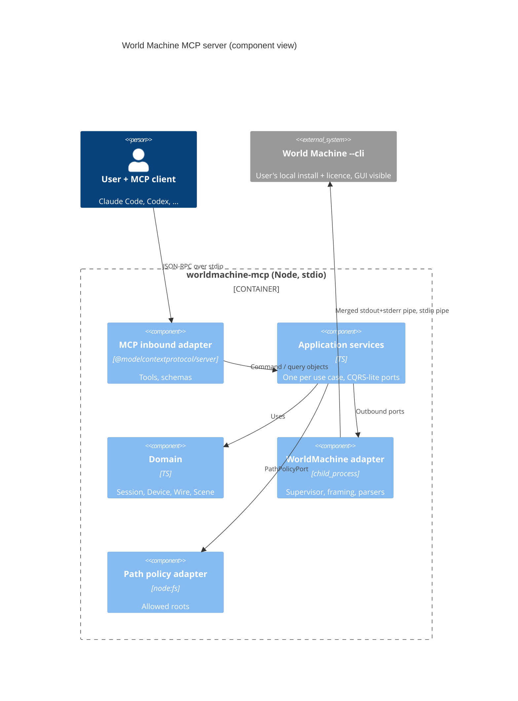
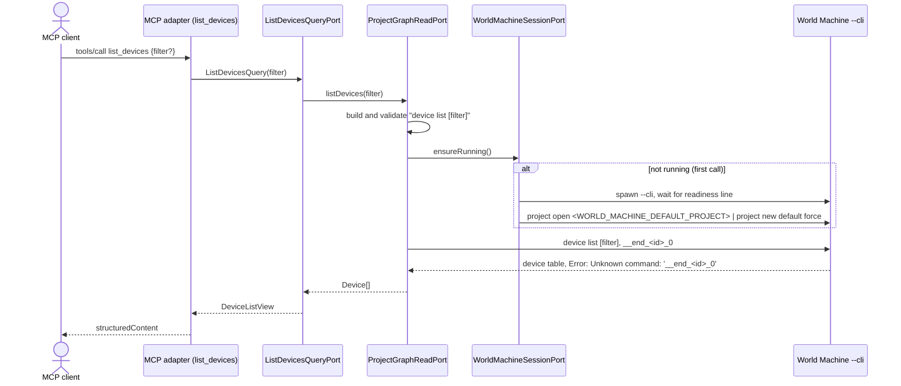
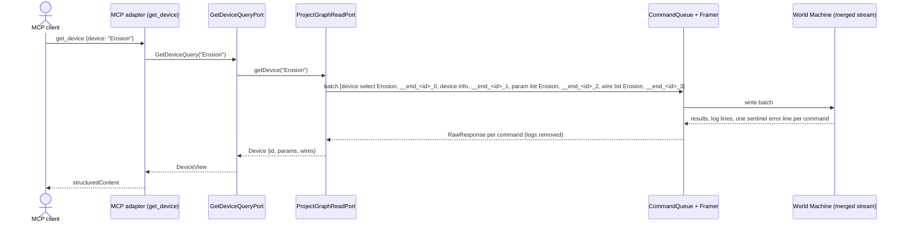

# worldmachine-mcp design

Date: 2026-10-04
Status: draft, awaiting review
Background: [feasibility findings](../../research/2026-10-04-feasibility-findings.md)

## 1. Purpose and scope

`worldmachine-mcp` is a public, MIT-licensed MCP server that lets any MCP client (Claude Code, Codex, Claude Desktop, Cursor, and others) inspect and edit World Machine projects through the user's own local World Machine installation and licence.

- Distribution: local stdio server, installed with a one-line client configuration (`npx -y @hoakt/worldmachine-mcp`).
- Platforms: Linux is the first slice. Windows and macOS are planned; the design keeps OS-specific code inside one adapter so they can be added without touching the domain or tool layers.
- World Machine is the only component that reads or writes `.tmd` files. The server never parses or edits project files directly.
- Nothing from World Machine is bundled. Users supply their own installation and licence.

### Releases

| Release | Content |
|---|---|
| v1 (this spec) | process adapter, read tools, project lifecycle, controlled graph edits, save, undo and redo |
| v2 | preview and full builds, exports, snapshots, organize |
| v3 | declarative `apply_graph` with dry-run plan and graph diff |

v2 and v3 get their own specs. This document specifies v1 only.

## 2. Verified facts this design rests on

Verified on 2026-10-04 against World Machine build 4067 (Dragontail Peak), Pro tier, Linux AppImage.

1. `--cli` works over plain pipes. No PTY is required. Commands are read from stdin and executed.
2. Over pipes, no `wm>` prompt is printed.
3. Command results are written to stdout, typically as a block ending in a blank line.
4. Command errors are written to stderr as a single line: `Error: Unknown command: '<cmd>'. Type 'help' for a list of commands.`
5. Application log lines are written to stdout with a `[Level      ] ` prefix and can appear between command results.
6. Startup readiness is signalled by the log line `Startup: Completed. Transferring control into event loop.` (about 4 s after spawn in testing).
7. `--cli` boots the full GUI. A window is shown. This is accepted behaviour (it gives the user a live view).
8. World Machine loads its sample project (Hurricane Ridge, project version 2023.01) at startup.
9. Device ids are stable integers shown as `#<n>` by `device list`.
10. `param list <device>` returns `name  type  value` rows. Types observed: `filename`, `enum`, `bool`, `action`.
11. An unquoted device name containing a space is accepted as the final argument (`param list Height Output`).
12. `system quit force` exits cleanly and returns the licence seat (log line `License Manager.Checkin: License returned to license server`).
13. Licence checkout success is logged as `License Manager.Checkout: License checkout successful`.

### Verification items (first tasks of the implementation plan)

These are unverified and must be resolved before the code that depends on them is written:

- V1. A merged stdout+stderr stream (section 5.1) delivers each command's result before the next command's error line.
- V2. Commands after a failing command in the same write batch still execute.
- V3. What `project new default` creates in build 4067, and that `project new default force` discards the sample project without prompting.
- V4. World Machine quoting rules for names containing spaces in multi-argument commands (`wire connect`, `device rename`, `param set`).
- V5. Output format of `device info`, `wire list`, `scene show`, `scene list`, `group list`, and `param get`.
- V6. Value syntax accepted by `param set` for `bool`, `enum`, numeric, and `filename` parameters.
- V7. Output and failure behaviour of `project open`, `project save`, `project undo`, and `project redo`.
- V8. The log line or exit behaviour when licence checkout fails. It cannot be provoked by a script and may stay open; until it is observed, a licence failure surfaces as `START_FAILED` through the exit-before-ready or readiness-timeout paths.

## 3. Technology

| Concern | Choice |
|---|---|
| Runtime | Node.js >= 22.12 (Node 20 reached end-of-life on 2026-04-30; Vitest 5 requires 22.12) |
| Language | TypeScript 7.0 (SDK requires >= 6.0 and `"types": ["node"]`) |
| MCP SDK | `@modelcontextprotocol/server` 2.x (`McpServer`, `registerTool`, `serveStdio` from `@modelcontextprotocol/server/stdio`) |
| Schemas | zod 4 via `zod/v4` (Standard Schema) |
| Tests | vitest 5, `@modelcontextprotocol/client` 2.x as a dev dependency |
| Native dependencies | none |
| npm package name | `@hoakt/worldmachine-mcp` (scoped, so the bare name stays free for an official World Machine package) |

The v1 SDK line (`@modelcontextprotocol/sdk`) is not used. `@modelcontextprotocol/node` is not used (it is HTTP middleware).

## 4. Architecture

Hexagonal, with CQRS-lite ports: one inbound port per use case, commands and queries in separate ports, each with its own input object. Outbound ports speak in domain types; all World Machine text handling stays in the adapter.

```text
src/
  domain/              Session, SessionState, ProjectBinding, DeviceId, Device, Parameter, Wire, Scene
  application/
    port/in/query/     <UseCase>Query + <UseCase>QueryPort, one file per port
    port/in/command/   <UseCase>Command + <UseCase>CommandPort, one file per port
    port/out/          WorldMachineSessionPort, ProjectGraphReadPort, ProjectGraphWritePort, PathPolicyPort
    service/           one service per inbound port
  adapter/
    in/mcp/            tool registration, zod schemas, mapping to and from command/query objects
    out/worldmachine/  Locator, ProcessSupervisor, CommandQueue, ResponseFramer, LogSplitter, CommandBuilder, parsers/
    out/fs/            PathPolicy implementation
  main.ts              composition root
```

### Outbound ports

| Port | Responsibility |
|---|---|
| `WorldMachineSessionPort` | `ensureRunning()` (lazy launch and project binding), `status()` (never launches), `shutdown()` |
| `ProjectGraphReadPort` | devices, device detail, parameters, wires, scene, project summary, as domain objects |
| `ProjectGraphWritePort` | project open, new, save, undo, redo; device add, rename, enable, disable, delete; parameter set; wire connect and disconnect; scene configuration |
| `PathPolicyPort` | resolve and authorise project paths against allowed roots |

Query services depend only on `WorldMachineSessionPort` and `ProjectGraphReadPort`. Only command services receive `ProjectGraphWritePort`.



## 5. World Machine adapter

| Unit | Responsibility |
|---|---|
| `Locator` | Resolve the executable from `WORLD_MACHINE_BIN`. v1 Linux has no default discovery; an unset or non-executable value yields `NOT_CONFIGURED`. |
| `ProcessSupervisor` | Lazy spawn, readiness detection (fact 6, 60 s limit), idle timeout, crash detection, shutdown sequence. |
| `CommandQueue` | Serialise all access. Accepts a batch of commands and runs it as one transaction so no other request interleaves. |
| `ResponseFramer` | Append a sentinel to each batch and split the merged stream into one `RawResponse { output, errors }` per command. |
| `LogSplitter` | Remove `[Level      ] ` lines from the stream and route them to the log channel. |
| `CommandBuilder` | Build command lines from validated tokens, apply World Machine quoting (per V4), reject unsafe tokens. |
| `parsers/` | Pure functions from text to domain objects. One module per command output format. |

### 5.1 Process spawn and framing

The Linux adapter merges stdout and stderr at the file-descriptor level so the kernel preserves their relative order:

```ts
spawn("/bin/sh", ["-c", 'exec "$0" --cli 2>&1', binPath], { stdio: ["pipe", "pipe", "ignore"] })
```

- `exec` replaces the shell; signals reach World Machine directly.
- `binPath` is passed as `$0` and never interpolated into the script.
- `--minimal` is not passed (user macros and blueprints stay available).

Every command in a batch is followed by its own sentinel `__end_<id>_<n>`, where `<id>` is a random per-batch token and `<n>` is the command's index in the batch. World Machine answers each sentinel with `Error: Unknown command: '__end_<id>_<n>'. ...`, which closes the frame of command `<n>`. Within a frame, lines starting with `Error: ` are errors of that command; all other non-log lines are its output. The blank-line block terminator (fact 3) is not relied on. V1 and V2 confirm that this ordering holds.

Windows and macOS adapters will define their own merge strategy.

### 5.2 Request flow

1. The MCP adapter validates input with zod and maps it to a command or query object.
2. The service calls a graph port. The adapter builds and validates the batch first, so a refused argument never launches World Machine.
3. The adapter calls `ensureRunning()` (lazy launch and project binding), then enqueues the batch.
4. The framer returns one `RawResponse` per command. Parsers produce domain objects.
5. The service returns a view. The MCP adapter returns it as `structuredContent` matching the tool's `outputSchema`, plus a JSON text block in `content`.
6. Every batch has a timeout (default 15 s, `WORLD_MACHINE_COMMAND_TIMEOUT_MS`). On timeout the session becomes `unhealthy`.





`device info` acts on the selected device, so `get_device` always runs as one batch.

## 6. Session model

`SessionState` is one of:

- `notRunning`
- `starting`
- `ready { binding: ProjectBinding, dirty: boolean }`
- `unhealthy { reason }`

`ProjectBinding` is `fresh` (created by the server) or `opened { path }`.

Rules:

- The server does not launch World Machine at startup. The first tool call that needs it calls `ensureRunning()`. `get_world_machine_status` never launches it.
- If `WORLD_MACHINE_DEFAULT_PROJECT` is set, it is authorised by the path policy *before* World Machine is launched. If the policy refuses it, the start fails with that error (`REFUSED`, or `NOT_CONFIGURED` when there are no allowed roots) and World Machine is not launched. There is no fallback to a fresh project.
- On launch, the server runs `project open <path>` for an authorised default project, otherwise `project new default force` (subject to V3). The sample project is never left active.
- Every successful command service call sets `dirty = true`, except `save_project`, which clears it, and `open_project` and `create_project`, which reset it.
- `open_project` and `create_project` return `REFUSED` when `dirty` unless `discard_unsaved: true`.
- `unhealthy` sessions are restarted by the next `ensureRunning()`.
- At most one World Machine process exists per server. A new process is started only after the previous one has exited.
- The idle timer never fires while a command is in flight. Idle quit and shutdown let running command batches finish before sending `system quit force`.

## 7. MCP tools (v1)

All tools declare `inputSchema` and `outputSchema`; a tool without arguments declares an empty object schema. Annotations follow the table. Every tool also sets `openWorldHint: false` (it acts only on the local World Machine), and read-only tools set `destructiveHint: false` explicitly because the SDK defaults it to `true`.

| Tool | Port kind | Annotations | Notes |
|---|---|---|---|
| `get_world_machine_status` | query | readOnly | `configured`, executable, build number and build name, session state, binding, dirty. Does not launch. |
| `list_devices` | query | readOnly | optional filter, non-empty when present (omit it to list everything) |
| `get_device` | query | readOnly | id, name, type, state, parameters, wires |
| `get_scene` | query | readOnly | name, origin, size, resolution, lock |
| `inspect_project` | query | readOnly | binding, scene, device count and list, groups |
| `open_project` | command | not destructive | path, `discard_unsaved` |
| `create_project` | command | not destructive | `discard_unsaved` |
| `add_device` | command | not destructive | exact type, optional name |
| `rename_device` | command | not destructive, idempotent | |
| `set_device_enabled` | command | not destructive, idempotent | enabled flag |
| `update_device_parameters` | command | not destructive, idempotent | map of name to value, per-item outcome |
| `connect_devices` | command | not destructive, idempotent | source and destination with optional port |
| `disconnect_devices` | command | not destructive, idempotent | |
| `configure_scene` | command | not destructive, idempotent | name, origin, size, resolution, each optional |
| `delete_device` | command | destructive | |
| `save_project` | command | destructive only with `overwrite: true` | path optional when binding is `opened`; existing target requires `overwrite: true` |
| `undo` | command | not destructive | |
| `redo` | command | not destructive | |

Devices are referenced by name or by `#<id>`. There is no raw console tool.

`update_device_parameters` reads `param list` first, validates every name and value against the reported type, and refuses the whole call if any item is invalid. It then applies all items in one batch and reports a per-item outcome. There is no automatic rollback; failure results point to `undo`.

## 8. Errors

Tool failures are returned as `isError: true` results. Protocol errors are left to the SDK (schema rejection). A `WorldMachineError` keeps its code wherever it arises, including during startup (a rejected `project open` at startup is `WM_COMMAND_FAILED`, an unparseable `system info` is `UNEXPECTED_OUTPUT`); only failures that are not `WorldMachineError`s are reported as `START_FAILED` during startup. In every startup failure, World Machine is quit before the error is returned. `worldMachineMessage` never contains log lines or lines matching `/licen[cs]e/i`. The error payload is:

```ts
{ code: ErrorCode, message: string, worldMachineMessage?: string, session: SessionSummary }
```

| `code` | Trigger | Effect |
|---|---|---|
| `NOT_CONFIGURED` | executable missing or not executable; no usable allowed root | none |
| `START_FAILED` | spawn error, no readiness line within 60 s, licence checkout failure (V8) | state returns to `notRunning` |
| `REFUSED` | dirty without `discard_unsaved`, existing target without `overwrite`, path not authorised, unsafe or ambiguous token | no command sent |
| `WM_COMMAND_FAILED` | an `Error: ` line for a command | exact text in `worldMachineMessage` |
| `TIMEOUT` | no sentinel within the batch timeout | state becomes `unhealthy` |
| `CRASHED` | unexpected process exit | state becomes `unhealthy`; message states that unsaved changes were lost when `dirty` was set |
| `UNEXPECTED_OUTPUT` | a parser cannot match output | includes a log-free raw snippet |

## 9. Safety

- **Command injection.** `CommandBuilder` rejects any token containing a character in `\x00`-`\x1f` or `\x7f`, and any token starting with `__end_`. Tokens whose quoting would be ambiguous under V4 are refused with `REFUSED`.
- **No shell exposure.** Model-supplied text is only ever written to World Machine's stdin as validated tokens.
- **Allowed roots.** `WORLD_MACHINE_ALLOWED_ROOTS`, separated by the platform path delimiter. When unset, the server's working directory is the only root, unless it is `/` or `$HOME`, in which case path tools return `NOT_CONFIGURED`.
- **Relative paths.** Project paths must be absolute; a relative path is refused with `REFUSED`, because the server's working directory is chosen by the MCP client and is not visible to the model.
- **Opening.** `realpath` the file, require it to be inside a root after resolution, require the `.tmd` extension, and require a regular file (a directory named `*.tmd` is refused). If none of the configured roots exists, path tools return `NOT_CONFIGURED`.
- **Saving.** `realpath` the parent directory, require it to be inside a root, require the `.tmd` extension. An existing target requires `overwrite: true`.
- **Shutdown.** On stdin close, `SIGINT`, or `SIGTERM`: write `system quit force`, wait 10 s, then `SIGTERM`, then `SIGKILL`. A dirty session at shutdown is logged as a warning.
- **Idle timeout.** `WORLD_MACHINE_IDLE_TIMEOUT_MS`, default 15 minutes, `0` disables. Quits World Machine to return the licence seat. Skipped and logged when `dirty`.
- **Logs.** World Machine log lines go to the server's stderr, filtered by `WORLD_MACHINE_LOG_LEVEL`. Licence lines are dropped. Log content never appears in tool results.

## 10. Configuration

| Variable | Default | Purpose |
|---|---|---|
| `WORLD_MACHINE_BIN` | none (required in v1) | World Machine executable |
| `WORLD_MACHINE_ALLOWED_ROOTS` | working directory (see section 9) | project path roots |
| `WORLD_MACHINE_DEFAULT_PROJECT` | none | project opened on launch |
| `WORLD_MACHINE_LOG_LEVEL` | `info` | log channel verbosity |
| `WORLD_MACHINE_COMMAND_TIMEOUT_MS` | `15000` | per-batch timeout |
| `WORLD_MACHINE_IDLE_TIMEOUT_MS` | `900000` | idle quit, `0` disables |

## 11. Testing

| Layer | Approach | Runs in |
|---|---|---|
| Domain | unit tests for session states and binding rules | CI |
| Parsers | recorded transcripts in `test/fixtures/wm-<build>/` | CI |
| CommandBuilder, path policy | injection cases; symlink escape on a temp directory | CI |
| Adapter integration | real supervisor, merge, queue, and framer against a fake World Machine script that replays fixtures and can hang, crash, or fail licence checkout | CI |
| Application services | in-memory fakes of outbound ports | CI |
| MCP adapter | `@modelcontextprotocol/client` driving `createMcpHandler` in-process through its `fetch` function | CI |
| Stdio smoke | spawn the built server over stdio with the fake World Machine | CI |
| Live contract | same scenarios against real World Machine, gated by `WM_LIVE=1` | developer machine |

- `npm run capture-fixtures` records transcripts from a real installation, redacts home, application, and config paths and licence lines, and stores them under the World Machine build number.
- A CI check fails if any fixture contains `/home/`, `/Users/`, `C:\Users\`, or `License`.
- CI: GitHub Actions on `ubuntu-latest`, Node 22 and 24: typecheck, lint, test, fixture scrub check, `npm pack --dry-run`.
- Development is test-first per unit. Verification items V1-V8 run first and their transcripts become fixtures.

## 12. Repository and packaging

- `README.md`: installation, client configuration snippets for Claude Code and Codex, configuration table, supported World Machine builds and platforms.
- `CONTRIBUTING.md`: fixture capture workflow for new World Machine builds.
- The published package contains `dist/`, `README.md`, and `LICENSE` only.
- `package.json` sets `"publishConfig": { "access": "public" }`, because scoped packages publish as restricted by default.
- Codex and Claude Code packaging (plugin manifests, bundled skill) are thin wrappers over the same server and are added after the v1 server works.

## 13. Out of scope for v1

- Builds, exports, snapshots, `device organize`, groups mutation (v2).
- `apply_graph` and graph templates (v3).
- Windows and macOS adapters.
- Default executable discovery.
- Remote or HTTP transport.
- Any raw console access.
