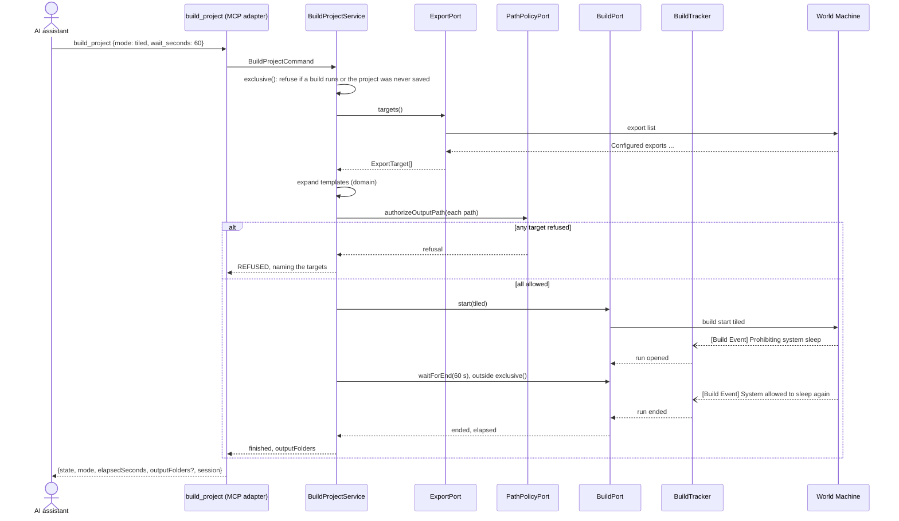

# worldmachine-mcp v2a design: builds and exports

Date: 2026-10-05
Status: draft, awaiting review
Builds on: [v1 design](2026-10-04-worldmachine-mcp-design.md) (facts 1-41, sections 4-11)

## 1. Purpose and scope

v2a lets the AI assistant check its edits by building, and deliver the result by exporting the outputs the user has set up:

- preview builds, full builds, and tiled builds, each started, observed, and stopped through the console;
- the export targets of a project, and `export all` into folders inside the allowed roots.

The v1 release table lists snapshots and `device organize` under v2 as well. They do not depend on builds and move to v2b, with their own spec.

Unchanged from v1: World Machine is the only program that reads or writes `.tmd` files; the console offers no world-settings commands (fact 41), so the tiled-build layout, output filenames, and output formats are set up in the World Machine window; `filename` parameters stay refused (v1 section 9).

## 2. Verified facts

Captured on 2026-10-05 against build 4067 with `npm run capture-fixtures`, scenarios `v2-build-export`, `v2-build-long`, `v2-build-isolate`, and `v2-build-concurrency` (raw transcripts in `test/fixtures/wm-4067/raw/`). Numbering continues from the v1 spec.

42. `build preview` prints `Preview build started.` and returns at once. A preview is visible to `build status` only: `Build in progress...` while it runs, `No build running.` once it ends. A preview prints no Build Event lines. World Machine also starts a preview on its own after `project new`, after `scene resolution`, and after `device disable` (status read `Build in progress...` for several seconds after each).
43. `build start` returns at once. Its frame holds `[Build Event] Prohibiting system sleep` and `[Build Event] *** Build Starting ***`. The build ends with `[Build Event] *** Build Ended ***` and `[Build Event] System allowed to sleep again`, printed whenever the build finishes. `Build started.` arrives later as an unsolicited line, after the build has ended in every capture. A full build of the default project at resolution 4097 took 44 s.
44. `build status` does not report full or tiled builds: it printed `No build running.` during a 4097 build that ended 44 s later (`v2-build-concurrency` l.85, l.113-114). A full or tiled build is observable only through its Build Event lines.
45. `build start` while a full build runs ends that build (`*** Build Ended ***`) and starts a new one in the same frame.
46. `build stop` prints `Stop requested.` whether or not anything is running. During a full build it is followed by `*** Build Ended ***`; during a preview, status reads `No build running.` immediately afterwards.
47. Build Event lines and the late `Build started.` / `Tiled build started.` lines arrive unsolicited: between batches, and inside the frame of whatever command is pending (seen in the frames of `build start`, `build stop`, `build status`, and `export list`). `[Build Event] ` does not match the log-line prefix of fact 5, because `Build Event` contains a space.
48. `build start tiled` prints `[Build Event] Prohibiting system sleep` and no Starting or Ended events. The tiled build ends with `[Build Event] System allowed to sleep again`, followed later by `Tiled build started.`, which is also printed for a stopped tiled build (two arrived together after a stop and a new start). A tiled build writes every File Output, Bitmap Output, and Material Output as tiles named `<expanded template>_x<i>_y<j>` into the folder its template resolves to, with the layout configured in the window (2 x 2 tiles of 256 in the default project, whatever the scene resolution). A plain `build start` writes no files.
49. `export list` prints `Configured exports:`, then one row per output, `  '<device name padded to 20>' -> <template>`, then a blank line. The default project's templates are `<project> <name>-<res>.png` (Height Output) and `<project> <name> <res>.png` (the others).
50. `export all` writes every output and prints `Successfully exported <n> file(s):`, one absolute path per file, and a blank line. Templates resolve against the folder of the saved `.tmd` file, with `<project>` the file name without `.tmd` and `<res>` the scene resolution. For a project never saved it wrote into `~/Documents/WorldMachine/` with `<project>` = `New Project`. Material Output is listed under one base name but writes four files, `<base>_diffuse.png`, `_disp`, `_mask`, and `_roughness`. After an edit without a new build, `export all` prints `Error: Error: Some output devices are not built. Run 'build' first, then export.` and writes nothing.
51. `exportAlways` and `tiled` exist on File Output devices only: `param get` on a Bitmap Output or Material Output prints `Error: Error: Parameter '<name>' not found on device '#<id>'.`
52. Two process-level failures were seen once each and not reproduced: a SIGSEGV in a batch of `project new default force`, `export list`, and `export all` sent shortly after a tiled build (`v2-build-long`); and, after the concurrency scenario, `project close force` then `system quit force` closed the window but left the process running until it was sent SIGTERM (fact 20: the licence seat then stays checked out).
53. (v1 spec: licence checkout failure.)
54. A full build's outputs can be exported only after its late `Build started.` (`v2-build-export-timing`, captured 2026-10-06). `export all` sent right after `*** Build Ended ***` and `System allowed to sleep again` prints `Error: Error: Some output devices are not built. Run 'build' first, then export.` (l.29-33); `Build started.` arrives about 1 s later (l.37-38), and `export all` then succeeds (l.40-46). After a second build, `export all` sent 3 s after the end also succeeds (l.50-68). A stopped full build prints the late line too (`v2-build-export` l.66-80). Neither capture with a restart (fact 45) shows a `Build started.` line after it, for the replaced run or the new one (`v2-build-concurrency` l.77-210, `v2-build-long` l.56-157).
55. `param get <device name>.exportAlways` reads a File Output's `exportAlways` by name (`v6-param-values` l.53-54); other outputs have none (fact 51). `param set Height Output.exportAlways true`, with the unquoted name, fails with `No device selected` and reads back `false` (`v6-param-values` l.53-60), but `param set #<id>.exportAlways true` sets it (`v6b-param-set` l.123-130, `p2c-edits` l.224-240), and the World Machine window can set it too. The full builds of fact 48 were captured with `exportAlways = false` only, so whether a full build writes the file of an output with `exportAlways = true` is not verified; the server assumes it may (section 6).

### Assumed (not verified)

- A1. A build started from the World Machine window prints the same Build Event lines on stdout. If it does not, such a build is invisible to the server and `get_build_status` reports `idle` while it runs. A1 decides whether window-started builds are tracked at all (section 3: the provisional run); a capture with a build started from the window would settle it.
- A2. `build stop` stops a tiled build before it writes all its tiles. The default layout finishes in about a second, and the layout cannot be enlarged from the console (fact 41), so stopping a long tiled build was never observed.
- A3. `export list` shows device names longer than 20 characters in full.
- A4. A build that fails (a device error) still ends with `*** Build Ended ***`. No failing build was captured, so `build_project` cannot report a failed build as failed; it reports `finished`.

## 3. Domain model

| Type | Kind | Content |
|---|---|---|
| `BuildMode` | value | `preview`, `full`, `tiled` |
| `TrackedBuildMode` | value | `full`, `tiled`: the modes observed through events (fact 44) |
| `BuildEvent` | value | `sleep-prohibited`, `starting`, `ended`, `sleep-allowed`, `build-started`, `tiled-started`; `build-started` ends a full run that showed its `ended` (fact 54), `tiled-started` is ignored |
| `BuildRun` | entity, one at a time | `mode: TrackedBuildMode \| 'unknown'`, `startedAt`, `startedBy: 'server' \| 'world-machine'`, `state: 'running' \| 'ended'`; mode `unknown` only for a run World Machine started, until its kind shows (below) |
| `ExportTarget` | value | device name and template, as `export list` prints them |
| `OutputPath` | value | a target's expanded path, or the reason it cannot be expanded |

`BuildRun` transitions, driven by events:

- `full`: `starting` opens a run (from `idle`, or replacing a running full run, fact 45). `ended` does not close it: the run keeps counting as running (the build guard refuses, waits keep waiting) until the late `build-started` arrives (fact 54), because its outputs cannot be exported before. Each `ended` owes one `build-started`; after a restart, whose frame holds `ended`, `sleep-prohibited`, `starting`, and `sleep-allowed` (fact 45), the replaced run's line is owed too, so the new run ends only on the last owed line and not on the old run's. If no `build-started` closes the run within 10 s of its `ended`, it ends anyway and nothing is owed any more. A full `ended` also owes the next `sleep-allowed`, which is then ignored, also when it arrives after the next run opened.
- `tiled`: the server opens the run when it sends `build start tiled` and sees `sleep-prohibited`; `sleep-allowed` closes it. `tiled-started` is ignored: it is a late confirmation (fact 48).
- Started in the World Machine window (A1): a `sleep-prohibited` while no server start is pending and no run is running (or the running full run already showed its `ended`) opens a provisional run with `startedBy: 'world-machine'` and mode `unknown`. A `starting` promotes it to `full`; a `sleep-allowed` that is not owed ends it (a tiled build shows no other event, fact 48). A `starting` without a provisional run or a pending server start opens a `full` run with `startedBy: 'world-machine'`. The owed-trailer rule is unchanged, so the captured restart order `ended`, `sleep-prohibited`, `starting`, `sleep-allowed` (`v2-build-long` l.56-60, `v2-build-concurrency` l.77-81) leaves the new run running, and a stop (`ended` in the stop frame, `sleep-allowed` in the next) ends it at its late line or the 10 s bound. Runs the server started are unchanged.
- Process exit drops the run.

Template expansion (`src/domain/output-template.ts`) is a pure function: `<project>` becomes the `.tmd` file name without extension, `<name>` the device name, `<res>` the scene resolution; the result is joined to the project folder unless it is absolute. A template with any other `<...>` token is not expanded and its target is refused, because its folder cannot be known. A device name may contain `/`, so the folder check uses the fully expanded path.

## 4. MCP tools

| Tool | Kind | Annotations | Behaviour |
|---|---|---|---|
| `build_project` | command | not read-only, destructive (a tiled build overwrites files), not idempotent | `{ mode, wait_seconds? }`. Refused while a full or tiled build runs. `tiled` first checks every export target (section 6). `full` first reads `exportAlways` of every export target (fact 55) and, when any is not confirmed off, checks every target as an export does (section 6). Starts the build, then waits up to `wait_seconds` (0-600, default 60) for it to end. Returns `{ state: 'finished' \| 'running', mode, elapsedSeconds, outputFolders?, session }`; `outputFolders`, the distinct folders of the expanded paths, only for `tiled`. A build ended by `stop_build` is reported as `finished`. |
| `get_build_status` | query | read-only | Never launches World Machine. Returns `{ build: { mode, elapsedSeconds, startedBy } \| null, previewRunning, session }`; `mode` is `full`, `tiled`, or, only for a run World Machine started, `unknown` (section 3). `previewRunning` comes from `build status` (fact 42), and is `false` without sending anything when World Machine is not running. |
| `stop_build` | command | not read-only, not destructive, idempotent | With a running full, tiled, or `unknown` build: sends `build stop` and waits up to 10 s for the end event. Otherwise, if `build status` reports a preview, sends `build stop` and reads status back. Returns `{ stopped: 'full' \| 'tiled' \| 'unknown' \| 'preview' \| null, session }`; `null` sends no `build stop`; `unknown` only for a run World Machine started. A run that does not end within 10 s, or a preview still running after the stop, is `WM_COMMAND_FAILED`; a run World Machine started that does not end is then dropped, so a stray event cannot block the change tools until World Machine restarts. Runs outside `exclusive()`, which refuses while a build runs. |
| `list_exports` | query | read-only | Returns `{ projectFolder: string \| null, targets: [{ device, template, path \| null, allowed, reason? }], session }`. `projectFolder` is `null` for a project never saved; every target is then not allowed. |
| `export_outputs` | command | not read-only, destructive (overwrites files), not idempotent | Refused while a full or tiled build runs, for a project never saved, and when any target is not allowed (every such target is named). Sends `export all` and returns `{ files: string[], note?, session }`: the paths World Machine reports, and a note when `device list` shows a Material Output (fact 50). |

Every output schema is a `z.strictObject` tied to its view type with `satisfies`, as in v1. Output fields are camelCase and every view carries `session`, as in v1.

`build_project` holds the session's `exclusive()` only while it checks and sends the start command, then waits outside it, so other tool calls are not queued behind the wait. If the client cancels the call while it waits, the build keeps running; `stop_build` stops it. When the client sends a progress token, the wait reports elapsed seconds every 5 s.

While a full or tiled build runs, including a run World Machine started whose mode is still `unknown` (section 3), read tools work as before and these command tools are refused with `REFUSED` and `A build is running; call stop_build or wait for it to finish`: every v1 command tool (`open_project`, `create_project`, `save_project`, the seven graph-edit tools, `configure_scene`, `undo`, `redo`), `build_project`, and `export_outputs`. A preview does not block anything: World Machine starts previews on its own after edits (fact 42), and a second `build_project` with `preview` or `full` simply replaces it.

## 5. Adapter and session

| Unit | Change |
|---|---|
| `build-events.ts` (new, `adapter/out/worldmachine/`) | `parseBuildEvent(line)`: the six lines of facts 43 and 48, exactly. |
| `WorldMachineProcess#onLine` | Runs `parseBuildEvent` before the log-line check. A build event goes to `onBuildEvent` listeners and is logged at debug level; it never reaches line listeners, so no command frame contains one (fact 47), whether it arrives inside or between batches. This also protects every v1 parser from a build's stray lines. |
| `BuildTracker` (new) | Holds the current `BuildRun`, applies events (section 3), and offers `ended(ms): Promise<boolean>` and `snapshot()`. Created per process and dropped on exit. |
| `WorldMachineBuilder` (new, implements `BuildPort`) | `start(mode)`, `previewRunning()`, `stop()`, `waitForEnd(ms)`. Confirms `Preview build started.` for previews (D12: a missing line is `UNEXPECTED_OUTPUT`). For `full` and `tiled` the start frame may hold only build events, which have been filtered out, so the confirmation is the tracker's `starting` or `sleep-prohibited` event within 5 s. A preview's end is polled with `build status` once a second. |
| `WorldMachineExporter` (new, implements `ExportPort`) | Parses `export list` (fact 49; names trimmed at the end) and `export all` (fact 50; the file count must match the rows). `Some output devices are not built` becomes `WM_COMMAND_FAILED` with the hint `run build_project with mode full first`. |
| `PathPolicyPort` | New method `authorizeOutputPath(path)`: the folder must exist, and its canonical path must be inside an allowed root. World Machine's handling of a missing folder is unknown (fact 23 shows a save into one fails silently), so a missing folder is refused rather than created. |
| Session | Refuses the command tools of section 4 while `BuildTracker` has a running run. Does not quit on the idle timeout while a run is running; the idle timer restarts when it ends. On shutdown with a running run, sends `build stop` and waits for the end event for at most half of the quit grace time, before `project close force` and `system quit force` (fact 52: `project close` racing a build is the likely crash). |

Outbound ports, one per concern, in `application/port/out/`: `BuildPort` (start, stop, wait, status) and `ExportPort` (list targets, export all). Inbound ports, one per use case: `BuildProjectCommandPort`, `StopBuildCommandPort`, `ExportOutputsCommandPort`, `GetBuildStatusQueryPort`, `ListExportsQueryPort`, each with its service. The export check is a small application helper shared by `ListExportsService`, `ExportOutputsService`, and `BuildProjectService` (tiled), like `project-rules.ts` in v1.

### Flow: a tiled build

## 6. Output paths and safety

- Exports and tiled builds write only where every target's expanded path lies in an existing folder inside the allowed roots, checked immediately before the command is sent. The check runs on all targets, not only the ones World Machine will write, because `export all` and a tiled build write every output (facts 48, 50).
- A project never saved is refused for both, because World Machine would write into `~/Documents/WorldMachine/` (fact 50).
- A full build counts as a write when any export target may have `exportAlways` set (fact 55). The read fails closed: each target's name is resolved against `device list` (any case, fact 31; listed names cut at 23 characters, fact 33), and only a name that resolves to exactly one device whose `param get #<id>.exportAlways` reads exactly `false`, or answers exactly the not-found error of fact 51, counts as off. Several or no matching devices, any other error, and any other reply count as set. Such a build then gets the export check, so a project never saved or a refused target refuses it. `update_device_parameters` refuses `exportAlways`, as it refuses `filename` parameters.
- An absolute template is allowed if its folder is inside the roots. A template with an unknown token is refused.
- A tiled build fills `<res>` with the tile resolution, not the scene resolution (`raw/v2-build-concurrency.txt` l.173-200: `256` at scene resolution 4097), which the console cannot read (fact 41). A template that uses `<res>` in a folder name is refused for a tiled build.
- An expanded path that exists as a symlink, a non-file, or a file with several hard links is refused; section 7 lists the path-form rules. The files a Material Output (`_diffuse`, `_disp`, `_mask`, `_roughness`) or a tiled build (`_x<i>_y<j>`) writes next to that path are not checked.
- A template, a device name, or an expanded path containing a `.` or `..` segment is refused, and a project whose file name stem is `.` or `..` cannot be saved or opened.
- An `export list` row containing more than one ` -> ` (quote, space, arrow) is refused as ambiguous.
- Existing files are overwritten: World Machine does not ask, and the names come from templates the user configured. The tool descriptions say so.
- The check and the write are not atomic: a folder swapped for a symlink in between is not caught. The same holds for v1 saves; it needs local write access to the roots. The race also covers a template changed in the World Machine window, and a Save As in the window between the check and the write (the server cannot see the window's current file).

## 7. Errors

No new error codes.

| Situation | Code |
|---|---|
| A command tool while a full or tiled build runs | `REFUSED` |
| Export or tiled build: project never saved, a target outside the roots or in a missing folder, an unknown template token | `REFUSED`, naming each target |
| `export all`: outputs not built | `WM_COMMAND_FAILED`, with the build hint |
| Any other `Error:` line from a build or export command | `WM_COMMAND_FAILED` |
| `Preview build started.` or `Stop requested.` missing, no start event within 5 s, an export count that does not match its rows | `UNEXPECTED_OUTPUT` |
| A run that does not end within 10 s of `build stop` | `WM_COMMAND_FAILED`; a run World Machine started is dropped, so it no longer blocks the change tools |
| A preview still running after `stop_build` | `WM_COMMAND_FAILED` |
| An output path that is relative, not normalised, a symlink, a non-file, or a file with several hard links | `REFUSED` |
| A tiled build with a template using `<res>` in a folder name | `REFUSED` |
| World Machine exits while `build_project` waits | `CRASHED`; the reopen rule of v1 section 6 applies (a build adds no unsaved changes) |
| The wait bound passes | not an error: `state: 'running'` |

## 8. Testing

- Unit: `parseBuildEvent` against the four transcripts; `BuildTracker` with fake timers (each transition of section 3, a replaced full run, a World Machine-started run (provisional, promoted to full, ended by `sleep-allowed`, restarted across its owed trailer), process exit, the wait bound); template expansion (each token, absolute templates, a `/` in a device name, unknown tokens); the `export list` and `export all` parsers against the transcripts, including the late `Build started.` inside an `export list` frame.
- Process: a build event inside a pending batch is removed from the frame and delivered to the tracker; one between batches is delivered too.
- Fake World Machine: `build preview|start|start tiled|stop|status`, `export list|all`, with scripted unsolicited events, including `*** Build Ended ***` sent while another command's batch is pending.
- Services and MCP: per tool, as in v1, including the refusal of every command tool during a build (one started in the World Machine window included), `stop_build` dropping a World Machine run that shows no end, strict output schemas, cancellation during the wait, and progress notifications.
- Live (`WM_LIVE=1`), in a temporary folder at resolution 257: preview; full build then `stop_build`; `export_outputs` after a full build and the files on disk; a tiled build and its tiles; `export_outputs` on an unsaved project refused with nothing written; `list_devices` while a 4097 build runs.

## 9. Documentation

The README gets the five tools in its table, a "Builds and exports" note (the wait bound, previews versus full builds, tiles, overwriting, the unsaved-project refusal), and the section "What the MCP can and cannot set up" drops builds and exports from its list of console features not yet exposed. The v1 spec's section 13 points to this spec.

## 10. Out of scope for v2a

- Snapshots and `device organize`: specified in [the v2b design](2026-10-06-worldmachine-mcp-v2b-design.md).
- `group build` and per-group builds: specified in [the v2b design](2026-10-06-worldmachine-mcp-v2b-design.md) as `build_project` mode `group`.
- Choosing which outputs to export: `export all` is the only export command (fact 49 lists no per-device form).
- Reporting a failed build as failed (A4).
- Setting output filenames, formats, or the tile layout (fact 41, v1 section 9).
