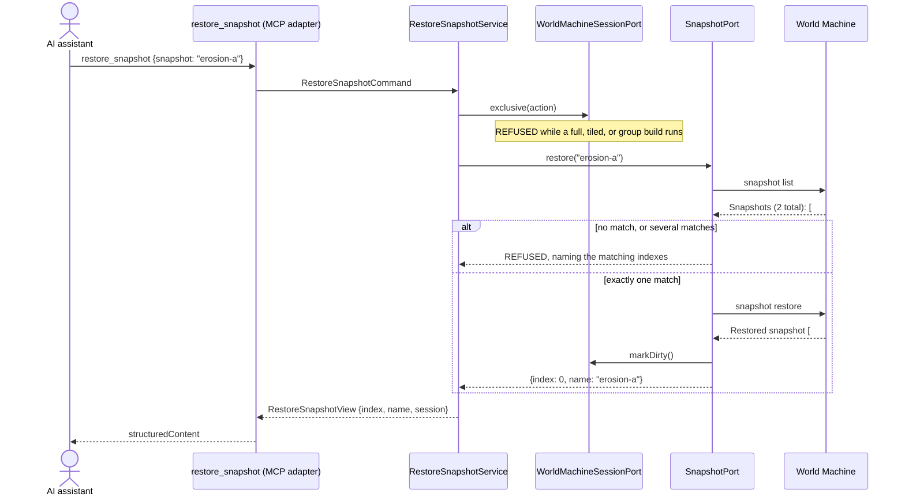

# worldmachine-mcp v2b design: snapshots, device organize, and groups

Date: 2026-10-06
Status: draft, awaiting review
Builds on: [v1 design](2026-10-04-worldmachine-mcp-design.md) (facts 1-41, 53, and 56, sections 4-11) and [v2a design](2026-10-05-worldmachine-mcp-v2a-design.md) (facts 42-52, 54, and 55; the build guard of section 4)

## 1. Purpose and scope

v2b completes the v2 release of the v1 release table. It lets the AI assistant use World Machine's snapshots in two ways:

- as a checkpoint: take a named snapshot before a risky series of edits, and restore it if the result is worse;
- as variants: keep several named versions of a project (for example two erosion setups) and switch between them, together with builds and exports.

It also exposes `device organize`, which lays out the graph in the World Machine window by processing order, and the device groups of a project: listing them, enabling or disabling all devices of a group at once, and building one group (an extension of the v2a `build_project` tool).

The snapshot tools are the same for both uses; only their descriptions name both. World Machine stays the only program that reads or writes `.tmd` files. Groups are created and filled in the World Machine window (fact 41).

## 2. Verified facts

Captured on 2026-10-06 against build 4067 with `npm run capture-fixtures`, scenarios `v2b-snapshots`, `v2b-snapshot-restore`, and `v2b-groups` (raw transcripts in `test/fixtures/wm-4067/raw/`). Numbering continues after fact 56.

57. `snapshot list` (alias `snapshots`) prints `No snapshots.` for a project without snapshots. Otherwise it prints `Snapshots (<n> total):`, one row per snapshot, `  [#<index>] '<name>' - <YYYY-MM-DD HH:MM>`, and a blank line. Indexes start at 0 in creation order (`v2b-snapshots` l.20-30, l.92-98).
58. `snapshot create <name>` prints `Created snapshot '<name>'`. A name may contain spaces, and a 40-character name was accepted. An empty name prints `Error: Error: Usage: snapshot create <name>`. A name that already exists is accepted again, which gives two snapshots with the same name; a name reference to them then prints `Error: Error: Multiple snapshots match '<name>':`, the matching rows, and `Use #index to specify which one.` (l.26-27, l.80-104).
59. Snapshots are stored in the `.tmd` file, not next to it: no new file appeared after `snapshot create` (l.16-36). `snapshot create` does not count as an unsaved change: a plain `project new default` went through right after it (l.38-39). A snapshot made after the last save is therefore lost when the project is closed without saving (l.47-48; `v2b-snapshot-restore` l.112-115). Saved snapshots survive a close and reopen with their index and time (`v2b-snapshots` l.208-231).
60. `snapshot restore <name|#index>` prints `Restored snapshot [#<index>] '<name>'`. It reverts the graph to the snapshot: a disabled device was enabled again and a device added after the snapshot was gone (`v2b-snapshot-restore` l.22-65). Snapshots made after the restored one are kept (l.77-81). A restore counts as an unsaved change (l.83-84). One `project undo` reverts the restore; the next undo reverts the edit before it (l.117-180).
61. `snapshot delete <name|#index>` prints `Deleted snapshot [#<index>] '<name>'`; the indexes after it shift down by one (`v2b-snapshots` l.233-250). A missing name prints `Error: Error: Snapshot not found: '<name>'`; an index out of range prints `Error: Error: Invalid snapshot index: #<n> (valid range: #0 - #<last>)`, for restore and delete alike (l.183-187, l.252-256).
62. `device organize` prints `Devices organized by processing order.` and counts as an unsaved change (l.261-286). `project undo` after it prints `Undo performed.` (l.293-297); what it reverts is a layout in the window, which the console cannot show.
63. `group list [filter]` prints `Groups (<n> total):`, one row per group, `  [#<index>] <name>  (<count> devices)` with the name padded and not quoted, and a blank line. Names may contain spaces, `&`, and `!`. With a filter, the header keeps the unfiltered total and only matching rows follow; a filter without a match prints the header and the line `  (no matches)` (`v2b-groups` l.16-32). The list does not show whether a group's devices are enabled.
64. `group disable <name|#index>` and `group enable <name|#index>` print `Disabled <n> device(s) in group '<name>'` and `Enabled <n> device(s) in group '<name>'`. They set every member device's own enabled state: the members show `[disabled]` in `device list`, and after two members were disabled one by one, `group disable` then `group enable` left all six enabled (l.34-56, l.152-206). Group names match regardless of case (l.260-261). Both count as unsaved changes (l.67-68). One `project undo` reverts the whole group; `project redo` applies it again (l.75-143).
65. A missing group prints `Error: Error: Group not found: '<name>'`; an index out of range prints `Error: Error: Invalid group index: #<n> (valid range: #0 - #<last>)`. A group without devices prints `Group '<name>' contains no devices.` with no `Error:` prefix and changes nothing (l.251-258).
66. `group build <name|#index>` prints `[Build Event] Prohibiting system sleep`, `[Build Event] *** Build Starting ***`, and `[Build Event] *** Build Ended ***` in its own frame; `System allowed to sleep again` follows, and the late line is `Building <n> device(s) in group '<name>'`, not `Build started.` (l.274-283). `build status` reads `No build running.` (l.286). A missing group prints `Error: Error: Group not found: '<name>'` (l.299-300).
67. A group build wrote no files, and `export all` after it still printed `Error: Error: Some output devices are not built. Run 'build' first, then export.` (l.292-295): a group build does not make the project's outputs exportable.

### Assumed (not verified)

- B1. Snapshot names longer than 40 characters are accepted up to the server's limit of 64.
- B2. `project undo` after `device organize` restores the previous layout (fact 62: the console shows no layout).
- B3. A snapshot restore keeps the project's scenes and world settings as they were in the snapshot, like the graph; only the graph was checked.
- B4. Two groups can share a name (the window may allow it); a name reference then resolves to one of them or fails. The server resolves names itself and refuses a name that matches several groups.
- B5. A group build writes the files of an output device with `exportAlways` set, as a full build might (v2a fact 55); the v2a check for full builds is applied to group builds too.
- B6. A stopped group build prints its own late line (the fake assumes it); if it does not, the run ends at the 10 s bound of v2a fact 54.
- B7. The singular row form `(1 device)` was not captured; the parser accepts `device` and `devices`.

## 3. MCP tools

| Tool | Kind | Annotations | Behaviour |
|---|---|---|---|
| `list_snapshots` | query | read-only | Returns `{ snapshots: [{ index, name, created }], session }`. `created` is the time World Machine prints (`YYYY-MM-DD HH:MM`), as a string. |
| `create_snapshot` | command | not read-only, not destructive, not idempotent | `{ name }`. Refused for an invalid name (section 4) or a name that an existing snapshot already has. Sends `snapshot create <name>`, then reads the list back: the new snapshot must be the last row, with that name, and the count one higher. Marks the session unsaved. Returns `{ index, name, created, session }`. The description says that a snapshot is stored in the project file and is kept only after `save_project`. |
| `restore_snapshot` | command | not read-only, destructive, not idempotent | `{ snapshot }`: a name, or `#<index>`. Reverts the graph to the snapshot; later snapshots are kept; one `undo` reverts the restore. Marks the session unsaved (World Machine does too). Returns `{ index, name, session }`. |
| `delete_snapshot` | command | not read-only, destructive, not idempotent | `{ snapshot }`. Reads the list back: the snapshot must be gone and the count one lower. Marks the session unsaved. Returns `{ index, name, remaining, session }`, with `remaining` the snapshots after the delete (indexes shift down). |
| `organize_devices` | command | not read-only, not destructive, idempotent | Sends `device organize`. `undo` reverts it (B2). World Machine counts it as an unsaved change; the server marks the session unsaved too. Returns `{ session }`. |
| `list_groups` | query | read-only | `{ filter? }`. Returns `{ groups: [{ index, name, deviceCount }], session }`. Group members are not listed: the console only gives a count. |
| `set_group_enabled` | command | not read-only, not destructive, idempotent | `{ group, enabled }`: a name or `#<index>`. Sends `group enable #<index>` or `group disable #<index>`. Returns `{ index, name, deviceCount, enabled, session }`. The description says that this sets every member device's own state, so enabling a group also enables members that were disabled one by one, and that one `undo` reverts the whole group. A group without devices is not an error: `deviceCount` is 0 and nothing changes. Marks the session unsaved when `deviceCount` is above 0. |
| `build_project` (v2a) | command | unchanged | Gains mode `group` and an input `group` (a name or `#<index>`), required for that mode and refused for the others. Sends `group build #<index>` after resolving the reference as in section 4, and applies the v2a `exportAlways` check for full builds (B5). A group without devices is refused before anything is sent. The run is tracked like a full build, and `get_build_status` and `stop_build` report it as mode `full`; its end is the late line of fact 66. The result for mode `group` names the group in a field `group: { index, name, deviceCount }`, and the description says that a group build does not make the outputs exportable (fact 67). |

Output fields are camelCase and every view carries `session`, as in v1 and v2a. Every output schema is a `z.strictObject` tied to its view type with `satisfies`.

A read-back that does not show a change World Machine confirmed is `WM_COMMAND_FAILED`, as for the v1 edit tools; a missing or different confirmation line, or a list that does not parse, is `UNEXPECTED_OUTPUT` (section 6).

The command tools run inside `exclusive()`, so the v2a build guard refuses them while a full, tiled, or group build runs. `list_snapshots` and `list_groups` are reads and work during a build.

## 4. Names and references

A snapshot reference in `restore_snapshot` and `delete_snapshot` is resolved by the server, never by World Machine:

1. The adapter reads `snapshot list` inside the same `exclusive()` action, so no other command can shift the indexes before the restore or delete is sent.
2. `#<n>` must be an index in the list. A name must match exactly one snapshot, compared exactly (case and spaces included, as World Machine compares). A name that matches several snapshots is refused, naming their indexes; one that matches none is refused.
3. The command is always sent as `snapshot restore #<index>` or `snapshot delete #<index>`, and the confirmation must name the same index and name.

A group reference in `set_group_enabled` and `build_project` mode `group` follows the same three steps with `group list` (no filter) and `group enable|disable|build #<index>`. Group names are compared regardless of case, as World Machine compares them (fact 64), and the padded names of the list are compared with their trailing spaces removed. Without a filter, the indexes of `group list` must run 0 to n-1; otherwise the list is `UNEXPECTED_OUTPUT`. The confirmation of `group enable` and `group disable` must name the same group. The start frame of `group build` holds only build events (fact 66), so a group build's group is confirmed by the resolution inside the same `exclusive()` action, not by a confirmation line.

A name for `create_snapshot` must be 1 to 64 characters, with no space at either end, no `'` (the list prints names inside quotes, so a quote inside a name would make a row ambiguous), no control characters, and not the form `#<n>`, which every later reference would read as an index. A name that an existing snapshot already has is refused, although World Machine accepts it (fact 58): a variant needs its own name, and a duplicate makes every later name reference ambiguous.

## 5. Adapter and ports

| Unit | Responsibility |
|---|---|
| `parsers/snapshot-list.ts` (new) | Parses fact 57. The header count must equal the number of rows, and indexes must run 0 to n-1; otherwise `UNEXPECTED_OUTPUT`. |
| `SnapshotPort` (new, `application/port/out/`) | `list()`, `create(name)`, `restore(ref)`, `remove(ref)`, in domain types (`Snapshot { index, name, created }`). |
| `WorldMachineSnapshotEditor` (new) | Implements `SnapshotPort`: the reference rules of section 4, the confirmation lines of facts 58, 60, and 61, the read-backs of section 3, and `session.markDirty()` as soon as World Machine accepts a create, restore, or delete (no `Error:` line), before the confirmation is checked (as the v1 editors do). |
| `DeviceEditPort.organize()` | Added to the existing device edit port and `WorldMachineDeviceEditor`: sends `device organize`, requires the confirmation line, calls `markDirty()` as soon as World Machine accepts it. |
| `parsers/group-list.ts` (extended) | Already exists for `inspect_project`; extended to parse fact 63 exactly, with a filtered mode. Without a filter the header count must equal the number of rows and the indexes must run 0 to n-1; with one, the indexes rise and stay below the total, and `  (no matches)` alone is an empty list. |
| `GroupPort` (new) and `WorldMachineGroupEditor` | `list(filter?)`, `setEnabled(ref, enabled)`, and `resolve(ref)` for the builder: the reference rules of section 4, the confirmation lines of facts 64 and 65 (the empty-group line is a success with `deviceCount` 0), `markDirty()` as soon as World Machine accepts a change, except for the empty-group answer. |
| Build classifier and domain (v2a) | `parseBuildEvent` learns `Building <n> device(s) in group '<name>'` as a late line of its own event (`group-build-started`). A full run started by `group build` ends on that line, under the same rules as v2a fact 54 (owed count, 10 s bound). This also fixes the tracking of a group build started from the World Machine window, whose late line is otherwise a plain line inside a command frame. |
| `WorldMachineBuilder.start` (v2a) | Mode `group` sends `group build #<index>`; the tracker expects a full run. |
| Inbound ports and services | `ListSnapshotsQueryPort`, `CreateSnapshotCommandPort`, `RestoreSnapshotCommandPort`, `DeleteSnapshotCommandPort`, `OrganizeDevicesCommandPort`, `ListGroupsQueryPort`, `SetGroupEnabledCommandPort`, each with its own query or command object and one service. `BuildProjectCommand` gains `group?`. |

The only new console commands are `snapshot list`, `snapshot create <name>`, `snapshot restore #<index>`, `snapshot delete #<index>`, `device organize`, `group list [filter]`, `group enable #<index>`, `group disable #<index>`, and `group build #<index>`. Names and filters go through the existing command builder as the final argument, like a device name.

### Flow: restore_snapshot

## 6. Errors

No new error codes.

| Situation | Code |
|---|---|
| An invalid name, a duplicate name on create, a reference that matches no snapshot or group, or several, an index out of range, `group` missing for mode `group` or given for another mode | `REFUSED` (checked against the list before anything is sent) |
| A command tool while a full, tiled, or group build runs | `REFUSED` (v2a build guard) |
| An `Error:` line from a snapshot, group, or organize command | `WM_COMMAND_FAILED` |
| A group without devices | not an error: `deviceCount` 0 |
| A missing or different confirmation line, a list that does not parse | `UNEXPECTED_OUTPUT` |
| A confirmed change whose read-back does not show it | `WM_COMMAND_FAILED` |
| A group build of a group without devices | `REFUSED` (checked before anything is sent) |

## 7. Testing

- Parsers: the three transcripts, including `No snapshots.`, a list after a delete, a filtered group list, and counts that do not match the rows.
- Build classifier and tracker: the group late line, and a replay of the `group build` part of `v2b-groups` that ends the run on that line.
- Fake World Machine: `snapshot list|create|restore|delete`, `device organize`, and `group list|enable|disable|build` as captured, with snapshots and group membership held in memory; a snapshot survives `project open` only when it existed at the last `project save` (fact 59); restore marks the project unsaved (fact 60); group enable and disable set each member's state (fact 64).
- Adapter and services: every refusal of section 4, `markDirty()` after each change, the read-backs, the empty group, `build_project` mode `group`, the build guard during a group build.
- MCP: inputs, strict output schemas, annotations of section 3.
- Live (`WM_LIVE=1`, after the user approves the run), in a temporary folder at resolution 257: create, an edit, restore and the edit gone, undo and the edit back, delete, organize, a save and reopen that keeps the saved snapshots, a group disable and enable checked with `list_devices`, and a group build that ends.

## 8. Documentation

The README gets the seven tools in its table, the `group` mode of `build_project`, a note that snapshots are stored in the project file and kept only after `save_project` and that duplicate names are refused, and a note that enabling or disabling a group sets every member's own state. The section "What the MCP can and cannot set up" moves snapshots and groups to what the MCP can do, and keeps creating groups and assigning devices in the window. The v1 spec's section 13 and the v2a spec's section 10 point to this spec.

## 9. Out of scope

- Comparing two snapshots or listing what changed between them: the console has no such command.
- Renaming a snapshot: the console has no such command.
- Creating groups, renaming them, or changing their members, and listing which devices a group holds: the console has no such commands (fact 41, fact 63).
